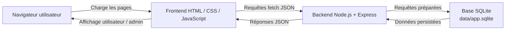

# Diagramme d'architecture

Ce diagramme présente l'architecture fonctionnelle du projet Sonia Line — cours particuliers de grec.

## Rôle des blocs

- **Navigateur** : affiche les pages publiques, le formulaire et le tableau de bord admin.
- **Frontend** : pages HTML, styles CSS, interactions JavaScript.
- **Backend Express** : routes API, validation serveur, réponses JSON.
- **SQLite** : stockage local des réservations et messages de contact.
