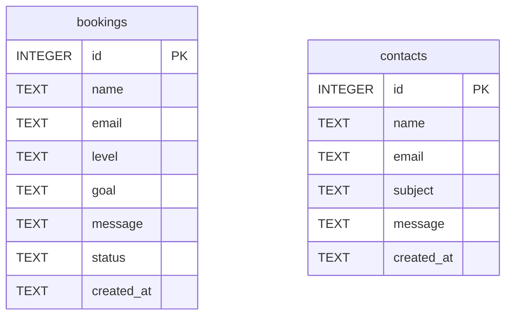

# Schéma de base de données

La base SQLite est créée automatiquement dans `data/app.sqlite`.

## Table `bookings`

Stocke les demandes de réservation de cours.

| Champ | Type | Rôle |
| --- | --- | --- |
| `id` | INTEGER | Identifiant unique |
| `name` | TEXT | Nom du visiteur |
| `email` | TEXT | Email du visiteur |
| `level` | TEXT | Niveau de grec |
| `goal` | TEXT | Objectif de cours |
| `message` | TEXT | Message complémentaire |
| `status` | TEXT | Statut de traitement |
| `created_at` | TEXT | Date de création |

## Table `contacts`

Stocke les messages de contact et une copie des demandes de réservation pour suivi administratif.

| Champ | Type | Rôle |
| --- | --- | --- |
| `id` | INTEGER | Identifiant unique |
| `name` | TEXT | Nom du visiteur |
| `email` | TEXT | Email du visiteur |
| `subject` | TEXT | Sujet du message |
| `message` | TEXT | Contenu du message |
| `created_at` | TEXT | Date de création |
