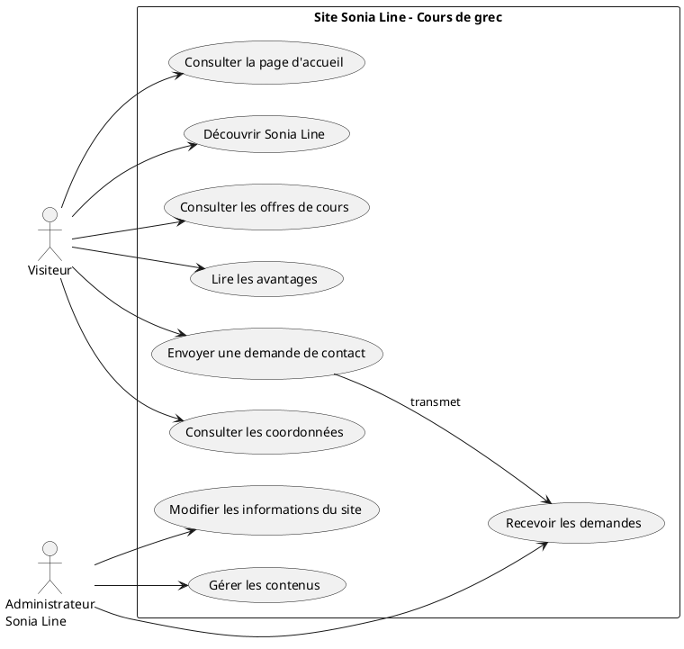

# Cas d’utilisation

## Acteurs

### Visiteur

Le visiteur consulte le site pour découvrir Sonia Line, comprendre les cours proposés et envoyer une demande de contact.

Cas d’utilisation :

- Consulter la page d’accueil.
- Découvrir Sonia Line.
- Consulter les offres de cours.
- Lire les avantages.
- Envoyer une demande de contact.
- Consulter les coordonnées.

### Administrateur / Sonia Line

Sonia Line est l’administratrice du contenu. Il n’y a pas de vraie interface d’administration dans ce projet, mais elle peut faire modifier les textes, recevoir les demandes et utiliser le site comme présentation de ses services.

Cas d’utilisation :

- Recevoir les demandes.
- Modifier les informations du site.
- Gérer les contenus.

## PlantUML

