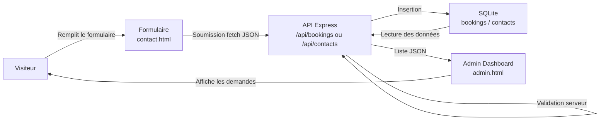

# Parcours utilisateur

Ce diagramme montre le parcours principal de réservation ou de contact.

## Étapes

1. Le visiteur remplit le formulaire de demande.
2. Le frontend envoie les données à l'API Express.
3. Le backend valide les champs et l'email.
4. Les données sont enregistrées dans SQLite.
5. Le tableau de bord admin récupère les données via l'API.
6. L'administrateur peut consulter les réservations et messages.
